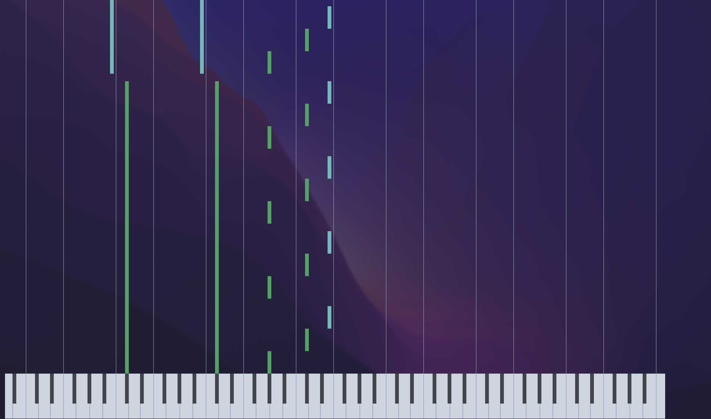
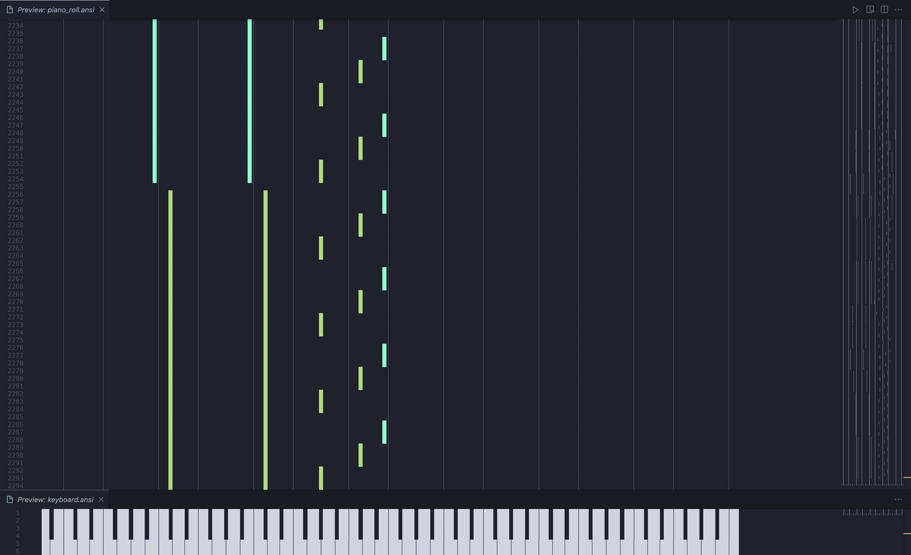

<h1 align="center">🎹 Terminal Piano Roll</h1>

<div align="center">
  
</div>

## Usage

```zsh
$ git clone https://github.com/ysnbogt/terminal-piano-roll
$ cd terminal-piano-roll
$ pip install .
$ piano_roll <file-path> [option...]
$ piano_roll ./sample.mid -c -b -k -m -p
```

## Option

| Option             | Description                                                                        |
| :----------------- | ---------------------------------------------------------------------------------- |
| `-c, --color`      | Show the piano roll with color coding for notes.                                   |
| `-b, --border`     | Add borders around the piano roll display.                                         |
| `-k, --keyboard`   | Display a keyboard layout below the piano roll.                                    |
| `-m, --music`      | Play the MIDI file alongside the piano roll animation.                             |
| `-p, --play`       | Animate the piano roll as it scrolls through the notes.                            |
| `-r, --resolution` | Set the resolution of the piano roll. Only even numbers are allowed (default: 10). |

## Sample

<div align="center">
  
</div>
